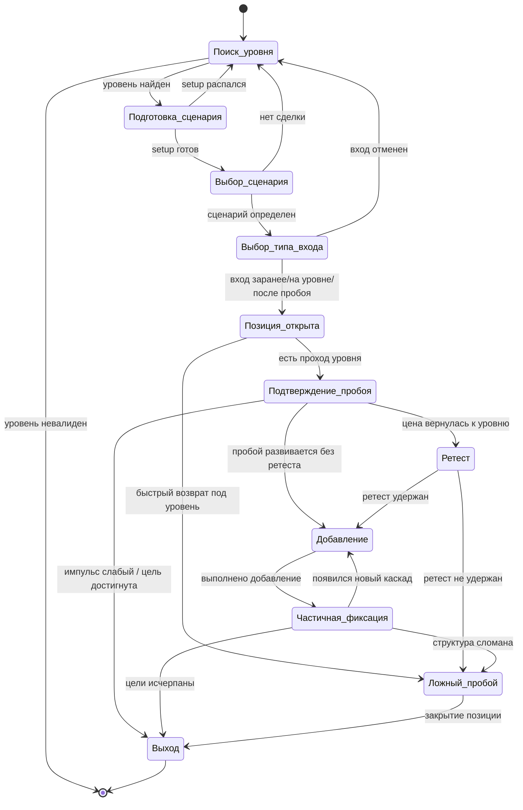
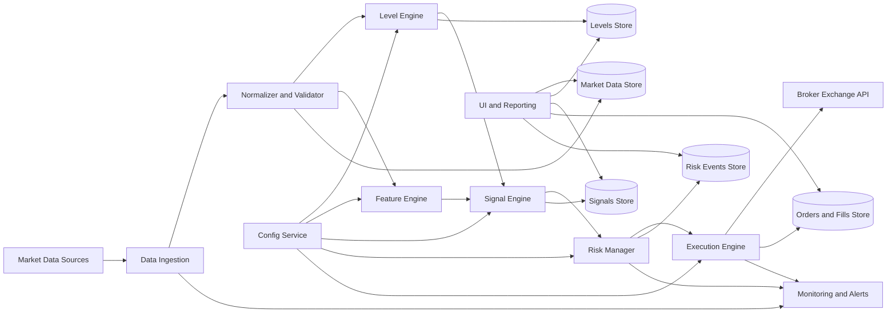

# SCNR Pro Boy

## Техническое задание на торговую систему стратегии пробоев

> Примечание по редактуре: исходный autogenerated-отчёт содержал встроенные
> маркеры ссылок, которые отображались как нечитаемые glyph-артефакты в обычном
> Markdown-preview. В этой версии они удалены ради читабельности; содержательные
> требования ТЗ сохранены.

## Краткое резюме

Настоящее ТЗ описывает разработку торговой системы и/или торгового робота для стратегии пробоев,
основанной на предоставленной заказчиком инфографике стратегии пробоев и ее визуальной логике: поиск
уровня, подготовка рынка, пробой, подтверждение, ретест, управление позицией, работа с ложным
пробоем и каскадное закрытие позиции. В исходном материале отдельно выделены три способа входа —
заранее, непосредственно на уровне и после факта пробоя, а также комбинированный режим, добавления
по ходу движения, фиксация позиции по схеме 30/50/20 и отдельная логика для пробоя консолидации,
каскадных уровней, локального максимума, наклонной и работы с плотностью.

Предмет разработки — модульная система, способная работать в трех режимах: advisory-only, semi-auto
и full-auto. Она должна принимать исторические и потоковые рыночные данные, детектировать уровни и
сетапы пробоя, вычислять оценку качества пробоя, управлять риском, исполнять заявки, вести журнал
решений и формировать полный комплект тестовой и эксплуатационной документации. Основа ТЗ оформлена
в логике классических российских подходов к программной и автоматизированной документации, близкой к
ГОСТ 19.201-78 и ГОСТ 34.602-2020, но адаптирована под практику торговых алгоритмов.

С точки зрения реализации, предпочтительна событийная архитектура с четким разделением на ingestion,
normalization, signal engine, risk manager, execution, persistence и reporting. Для торговых данных
в типовом контуре должны поддерживаться как свечные OHLCV-данные, так и тики; при наличии доступа
может быть подключен стакан, но он считается факультативным источником. В официальной документации
MetaTrader 5 для Python указано, что бары возвращаются с полями
`time`, `open`, `high`, `low`, `close`, `tick_volume`, `spread`, `real_volume`.
Время требуется нормализовать к UTC; доступны таймфреймы, включая 15 минут,
H1, H4 и D1. Отдельно поддерживаются тики и, при подписке, данные стакана.

Ключевой ожидаемый результат проекта — не просто “робот, который входит на пробой”, а
воспроизводимая и тестопригодная система принятия решений. Это означает, что торговая логика должна
быть формализована в виде конечного автомата, параметры должны быть полностью конфигурируемыми,
тесты должны разделять in-sample и out-of-sample этапы, а эксплуатационный контур обязан
обеспечивать контроль рисков, аудит действий и безопасное хранение ключей доступа. Практики
централизованного управления секретами, разграничения доступа, аудита и журналирования прямо
рекомендуются OWASP, а NIST CSF 2.0 позиционируется как рамка снижения киберрисков для отрасли,
государства и организаций.

## Контур проекта и предмет автоматизации

Система предназначена для алгоритмизации discretionary-стратегии пробоев, представленной в
инфографике заказчика. В ней явно выделены следующие логические сущности: поиск уровня, подготовка
сетапа, несколько способов входа, подтверждение пробоя, ретест, добавления, ложный пробой и
каскадная фиксация результата. Отдельно в исходном материале подчеркивается ценность медленного
подхода к уровню, предварительной проторговки, каскадных уровней, локальных максимумов рядом с
уровнем, работы в сторону основного рыночного направления и более быстрых выходов при пробоях лоев.

| Параметр | Требование |
|---|---|
| Назначение системы | Автоматизация стратегии пробоев для анализа, тестирования, paper trading и реального исполнения |
| Режимы работы | Advisory-only, semi-auto, full-auto |
| Типы рынков | Форекс, крипто, фьючерсы, CFD, акции — при наличии корректных данных и поддерживаемого брокерского/API-контура |
| Базовые таймфреймы | M15, H1, H4, D1 |
| Базовые данные | Свечи OHLCV, тики |
| Дополнительные данные | Стакан, лента/агрессор, активность — опционально |
| Основные сценарии | Пробой консолидации, каскадных уровней, локального экстремума, наклонной, пробой с поддержкой “плотности” |
| Основные выходы артефактов | Сигналы, сделки, логи решений, отчеты бэктеста, конфигурации, документация |

В проектный контур входят четыре стадии использования. Первая — исторический анализ и бэктест.
Вторая — paper trading на потоковых данных. Третья — ограниченный боевой запуск с пониженными
лимитами риска. Четвертая — эксплуатация с мониторингом и регулярной переоценкой параметров. Такой
порядок принципиален: в стратегии пробоев недопустимо сразу переносить discretionary-идею в
полностью автоматическое исполнение без формальной верификации каждого сценария, так как исходная
инфографика сама указывает на различие вероятностей истинного и ложного пробоя, зависимость
результата от контекста и риск “входа на вере” до факта события.

Обязательным ограничением проекта является устранение look-ahead bias. Все правила, использующие
локальные экстремумы, pivot high/low и каскадные структуры, должны в online-режиме опираться только
на уже закрытые бары и подтвержденные паттерны. Если pivot определяется через левое и правое окно,
он может считаться валидным только после закрытия `right_window` баров после предполагаемого
экстремума.

## Правила стратегии и торговая логика

Основа стратегии — торговля пробоев значимых уровней. В исходной инфографике заказчика источниками
уровней названы pivot high, pivot low, round numbers, daily high/low и cascade levels; критерии
уровня — минимум 2–3 касания, видимость на H1/M15, отсутствие недавнего пробоя и значимость реакции
цены. Подготовка к пробою строится вокруг консолидации, снижения ATR, “медленного подхода” и
движения по тренду.

| Тип уровня | Алгоритм обнаружения | Критерии валидности | Примечание |
|---|---|---|---|
| Pivot High | Бар `i` имеет `High[i]` выше `n_left` слева и `n_right` справа | Не менее `min_touches`, реакция цены не ниже `min_reaction_atr * ATR(H1)` | В live-режиме подтверждается после `n_right` закрытых баров |
| Pivot Low | Аналогично по `Low[i]` | Аналогично | Зеркальная логика для short |
| Round Number | Квантование цены по `round_step` | Отклонение не выше `touch_tolerance` | `round_step` задается по инструменту |
| Daily High/Low | High/Low предыдущего D1 либо текущей сессии | Должен совпадать с реакцией на M15/H1 | Для intraday имеет повышенный приоритет |
| Cascade Level | Последовательность локальных уровней по направлению движения | Минимум `cascade_min_count`, интервалы не шире `cascade_gap_atr` | Используется для добавлений и сценария разгона |
| Trendline/Naklonnaya | Локальные касания наклонной линии | Не менее 3 касаний, без чрезмерного угла | Не путать с произвольной линией тренда |

Критерии готовности сетапа должны вычисляться в отдельном модуле `SetupEvaluator`. Требуется
реализовать следующие факторы: консолидация перед уровнем, замедленный подход к уровню, трендовый
контекст, всплеск объема/активности и наличие поддержки в сторону пробоя. Из инфографики заказчика
следует, что наиболее качественный пробой — это не просто касание уровня, а подготовленный подход
без резкого отскока, чаще в сторону основного направления рынка.

| Фактор score | Способ расчета | Рекомендуемый вес по умолчанию | Диапазон |
|---|---|---|---|
| Консолидация | Сжатие диапазона, снижение ATR, уменьшение дисперсии | 20 | 0–20 |
| Медленный подход | Низкая скорость подхода, малые откаты, отсутствие паники | 20 | 0–20 |
| Тренд | EMA50/EMA200 и ADX | 20 | 0–20 |
| Объем / активность | Рост объема на поджатии или в момент пробоя | 20 | 0–20 |
| Плотность / поддержка | DOM-поддержка либо прокси по активности | 20 | 0–20 |

Рекомендуемая базовая логика принятия решения по суммарному `breakout_score`:

- если `score >= 70`, сетап допускается к нормальному риску;
- если `50 <= score < 70`, сетап допускается только с пониженным риском;
- если `score < 50`, сделка запрещена.

Это стартовый baseline-конфиг, а не жесткое ограничение: все веса и пороги
должны быть параметризованы.

Логика входов должна поддерживать три способа, прямо отраженные в исходной методике. Первый —
“заранее”, малой частью до факта пробоя, если есть очевидная подготовка. Второй — “на уровне”, когда
вход выполняется при касании или “разъедании” уровня/плотности. Третий — “после пробоя”, когда вход
выполняется по отложенному или рыночному сценарию уже после пересечения уровня. В исходном материале
отдельно отмечено, что заранее нельзя набирать весь объем, так как до уровня вероятность пробоя еще
не окончательно сформирована, а преждевременная агрессия может собрать лишние стопы.

| Способ входа | Условие активации | Доля базовой позиции по умолчанию | Правило отмены |
|---|---|---|---|
| Заранее | `score_pre_entry >= pre_entry_threshold`, есть медленный подход и консолидация | 30% | При резком встречном импульсе, исчезновении сетапа или нарушении структуры |
| На уровне | Касание уровня, разъедание плотности, подтвержденная активность | 30% | При отскоке без активности в сторону пробоя |
| После пробоя | Закрытие/проход выше уровня + `score >= breakout_threshold` | 40% | Если пробой не удержан в `false_breakout_max_bars` |

Подтверждение пробоя для long должно формально определяться так:

```text
breakout_long_confirmed =
    (close_or_tick_price > level + breakout_buffer)
    AND (score >= score_threshold)
    AND (optional trend filter passes)
```

Где `optional trend filter passes` по умолчанию означает `EMA50 > EMA200` и `ADX > 25` для long либо
симметрично для short. Официальная документация MQL5 подтверждает наличие стандартных индикаторных
примитивов iMA, iATR и iADX, что достаточно для эталонной реализации фильтров тренда и
волатильности.

Ретест обязателен как отдельный сценарий сопровождения, а не только как постфактум-описание графика.
В рамках ТЗ ретест считается валидным, если после подтвержденного пробоя цена возвращается в зону
`level ± retest_tolerance`, не ломает базовую структуру пробоя, удерживает уровень, затем формирует
micro-impulse в сторону сделки. В исходной инфографике заказчика ретест описан как возврат к уровню,
удержание и новый импульс вверх; при валидном ретесте допускается добавление позиции, подтяжка стопа
под уровень и последующее продолжение движения.

Управление позицией должно реализовывать как минимум две сущности: первичный вход и добавления.
Добавления разрешаются только если пробиваются новые локальные экстремумы, каскадные уровни или
подтвержденный ретест, а средняя цена не ухудшается сверх допустимого лимита. Базовая рекомендация
из инфографики — добавления по 10–20% от позиции, не более двух добавлений, со сбросом добавленной
части при откате к уровню добавления.

Выход из позиции должен поддерживать каскадную схему фиксации: первая фиксация `30%`, вторая `50%`,
остаток `20%` как runner/trailer. После первой фиксации стоп должен переноситься в безубыток или в
небольшой защищенный плюс; для последней части допускается трейлинг по структуре, ATR или последнему
каскадному уровню. Для пробоя лоев требуется отдельная опция “fast exit mode”, потому что исходный
материал прямо указывает: пробой лоев обычно формируется быстрее, часто на стопах лонгистов, и его
требуется закрывать заметно оперативнее, чем пробой хаев.

Ложный пробой должен детектироваться как полноценный сценарий отказа, а не просто как закрытие по
стопу. Для long сценария false breakout следует фиксировать, если цена пробила уровень вверх, но в
течение `false_breakout_max_bars` вернулась под уровень, закрылась ниже
`level - false_breakout_buffer`, сформировала потерю структуры
(`Lower High`/слом импульса) и не удержала ретест. Система обязана как минимум
закрыть long; реверс в short допускается только при отдельном флаге
конфигурации `allow_reversal_on_false_breakout = true`.

## Алгоритмическая модель и конечный автомат

Ниже задан обязательный эталон конечного автомата. Реализация может отличаться на уровне классов и
интерфейсов, но логические состояния и переходы должны сохраняться.



Алгоритм выбора сценария пробоя должен быть детерминированным и основанным на приоритизации сетапов.
Если одновременно выполнены несколько условий, приоритет рекомендуется задавать в следующем порядке:
пробой консолидации, пробой каскадных уровней, пробой локального экстремума возле уровня, пробой
наклонной, пробой при поддержке плотности. Такой порядок оправдан тем, что в исходной методике
именно поджатие/консолидация и каскадная структура занимают центральное место, а работа с плотностью
рассматривается как отдельный, более опциональный блок.

| Состояние | Входные условия | Выходные действия | Переход |
|---|---|---|---|
| `LEVEL_SEARCH` | Новый бар M15/H1/D1, обновление экстремумов | Пересчитать уровни, инвалидации, касания | `SETUP_READY` или повтор |
| `SETUP_READY` | Есть валидный уровень и контекст | Рассчитать ATR, EMA, ADX, score | `SCENARIO_PICK` |
| `SCENARIO_PICK` | Достаточный score и найденный паттерн | Выбрать сценарий A/B/C/D/E | `ENTRY_MODE_PICK` |
| `ENTRY_MODE_PICK` | Определен способ входа | Сформировать trade plan | `POSITION_OPEN` |
| `POSITION_OPEN` | Отправка/подтверждение ордера | Записать факт входа, стартовый стоп и risk budget | `BREAKOUT_CONFIRM` |
| `BREAKOUT_CONFIRM` | Цена удержала пробой | Включить режим ретеста/добавлений | `RETEST_MONITOR` или `ADDON_MONITOR` |
| `RETEST_MONITOR` | Возврат к уровню | Валидировать удержание, возможно добавить | `ADDON_MONITOR` или `FALSE_BREAKOUT` |
| `ADDON_MONITOR` | Новый импульс/локальный пробой | Добавить часть позиции | `PARTIAL_EXIT` |
| `PARTIAL_EXIT` | Достигнуты цели | 30/50/20, перенос стопа | `COMPLETE` или назад в `ADDON_MONITOR` |
| `FALSE_BREAKOUT` | Потеря уровня, слом структуры | Закрыть или реверс по флагу | `COMPLETE` |

Псевдокод открытия long должен быть реализован по следующей нормативной схеме:

```text
1. Обновить уровни H1/M15/D1.
2. Отбросить уровни, пробитые недавно или имеющие < min_touches.
3. Для каждого уровня оценить setup:
   - есть ли консолидация,
   - есть ли медленный подход,
   - совпадает ли контекст по EMA50/EMA200,
   - ADX > threshold,
   - есть ли объем/активность,
   - есть ли плотность/поддержка.
4. Рассчитать breakout_score.
5. Выбрать сценарий.
6. Сформировать план входа:
   - pre-entry,
   - entry-at-level,
   - post-breakout.
7. Рассчитать стоп, размер позиции и допустимые добавления.
8. Отправить заявку только если risk manager разрешил операцию.
9. После входа отслеживать:
   - подтверждение пробоя,
   - ретест,
   - ложный пробой,
   - добавления,
   - частичные фиксации.
10. Завершить сделку и зафиксировать полный аудит решения.
```

Логика risk manager должна быть блокирующей. Это означает, что signal engine не может напрямую
открыть сделку. Он формирует `TradeIntent`, а модуль управления риском либо утверждает его, либо
переводит в отказ с кодом причины. Базовая формула размера позиции:

`position_size = floor((equity * risk_pct) / stop_distance_money)`

где

`stop_distance_money = abs(entry_price - stop_price) * contract_multiplier`

Для добавлений должна применяться отдельная переменная `remaining_risk_budget`, чтобы суммарный риск
по сделке после всех добавлений не превышал конфиг `max_total_trade_risk_pct`.

## Архитектура, модули и интеграции

Для данного класса стратегии низкая задержка не является критичной в смысле HFT, поскольку основные
рабочие таймфреймы — M15, H1, H4 и D1. Требование к latency следует формализовать прагматично:
генерация сигнала после закрытия бара не позднее 1 секунды при нормальном состоянии системы; реакция
на tick/event в режиме пробоя — не позднее 100–300 мс внутри прикладного контура; подтверждение
отправки заявки и фиксация результата — не позднее 2 секунд при доступности брокерской
инфраструктуры. Надежность, идемпотентность и корректность журналирования здесь важнее
микрооптимизации.



Исторические и потоковые данные должны приниматься через абстракцию `MarketDataProvider`. На одном
из эталонных контуров MetaTrader 5 эта абстракция может быть реализована через `copy_rates_from` для
баров, `copy_ticks_from` для тиков, `market_book_get` для стакана и `order_send` для исполнения
торговых действий. Официальная документация MQL5 описывает именно такие сущности и возвращаемые
структуры, включая `MqlTradeRequest` и `MqlTradeResult`.

| Модуль | Назначение | Основные функции | Вход | Выход |
|---|---|---|---|---|
| Data Ingestion | Получение данных | `fetch_bars`, `fetch_ticks`, `fetch_dom`, `stream_subscribe` | API/CSV/Parquet/WebSocket/Terminal | Raw market events |
| Normalizer | Приведение форматов | `normalize_time`, `deduplicate`, `resample`, `fill_gaps` | Raw events | Canonical bars/ticks |
| Level Engine | Поиск уровней | `detect_pivots`, `detect_round_levels`, `detect_daily_levels`, `detect_cascade` | OHLCV | Список уровней |
| Feature Engine | Расчет признаков | `calc_atr`, `calc_ema`, `calc_adx`, `calc_consolidation`, `calc_activity_score` | Bars/ticks/DOM | Feature vector |
| Signal Engine | Выбор сценария и сигналов | `select_scenario`, `calc_breakout_score`, `build_trade_intent` | Levels + features | TradeIntent |
| Risk Manager | Контроль риска | `approve_trade`, `size_position`, `approve_addon`, `enforce_limits` | TradeIntent + account state | Approved/Rejected trade |
| Execution Engine | Исполнение ордеров | `send_order`, `cancel_order`, `modify_sl_tp`, `sync_positions` | Approved trade | Orders/fills |
| Persistence | Хранение | `save_market_data`, `save_signals`, `save_orders`, `save_logs` | All events | DB/object storage |
| Reporting | Отчеты и визуализации | `backtest_report`, `equity_curve`, `trade_list_export` | Runs + metrics | PDF/HTML/CSV |
| UI | Настройки и наблюдение | `dashboard`, `config_editor`, `manual_override` | Runtime state | Operator actions |
| Monitoring | Оповещения и SRE | `healthcheck`, `alert_risk`, `alert_feed_gap` | Infra + business events | Alerts |

| Интеграция | Обязательность | Назначение | Минимальные операции |
|---|---|---|---|
| Исторические бары | Да | Бэктест, feature engineering | Получение OHLCV, UTC-нормализация |
| Потоковые тики | Да | Реалтайм-подтверждение пробоя | Подписка/поллинг, last tick |
| Стакан | Нет | Работа с плотностью | Подписка, снимок DOM |
| Торговое API | Да для full-auto | Открытие, закрытие, модификация ордеров | Send/modify/cancel/query |
| Хранилище БД | Да | Аудит и воспроизводимость | Insert/query/export |
| Уведомления | Да | Мониторинг и инциденты | Email/Telegram/Slack/Webhook |

Стек реализации в ТЗ не фиксируется жестко, однако допустимые варианты следует оценивать
прагматично.

| Вариант | Сильные стороны | Ограничения | Рекомендуемая роль |
|---|---|---|---|
| Python | Быстрая разработка, исследование, backtesting, ML/аналитика | Требует аккуратной оптимизации realtime-контура | Базовый кандидат для ядра и отчетности |
| C++ | Наивысшая производительность, нативные коннекторы | Более дорогая разработка | Execution/latency-critical части |
| MQL5 | Максимально близок к MT5-исполнению и индикаторам | Привязка к экосистеме MetaTrader | Execution adapter / strategy port |
| Node.js | Сильный web/backend и интеграции | Менее удобен для quant-ядра | UI, orchestration, admin APIs |

Требования к логированию должны включать технический и бизнес-уровень. Необходимо логировать не
только системные ошибки, но и торговые решения: уровень, сценарий, score, факторы в score, факт
разрешения/блокировки сделки risk manager’ом, отправку заявки, изменение стопа, частичные фиксации,
перевод в безубыток, детекцию ложного пробоя и ручные override-действия оператора. OWASP отдельно
подчеркивает значимость audit trail для добавления/изменения/выгрузки данных, compliance monitoring
и последующего расследования инцидентов.

## Параметры, конфигурация и хранение данных

Все пороги и коэффициенты должны быть вынесены в конфигурацию и поддерживать versioning.
Конфигурация должна быть внешней по отношению к исполняемому коду, применяться без перекомпиляции и
сохраняться вместе с результатами бэктеста и боевого запуска. Это критично для воспроизводимости.

| Группа параметров | Параметр | Тип | Значение по умолчанию | Комментарий |
|---|---|---:|---:|---|
| Уровни | `pivot_left_bars` | int | 3 | Подтверждение pivot слева |
| Уровни | `pivot_right_bars` | int | 3 | Подтверждение pivot справа |
| Уровни | `min_touches` | int | 2 | 2–3 по методике |
| Уровни | `recent_break_lookback_bars` | int | 96 | Запрет на недавно пробитый уровень |
| Уровни | `touch_tolerance_atr` | float | 0.10 | Толеранс касания от ATR |
| Уровни | `round_step` | float | instrument-specific | Шаг круглого уровня |
| Setup | `consolidation_bars` | int | 8 | Количество баров в проторговке |
| Setup | `consolidation_max_range_atr` | float | 1.20 | Допустимый диапазон |
| Setup | `slow_approach_max_velocity` | float | 0.35 | Нормализованная скорость |
| Setup | `atr_period` | int | 14 | Для ATR |
| Trend | `ema_fast` | int | 50 | EMA50 |
| Trend | `ema_slow` | int | 200 | EMA200 |
| Trend | `adx_period` | int | 14 | Для ADX |
| Trend | `adx_threshold` | float | 25.0 | Фильтр направления |
| Score | `score_threshold` | int | 70 | Нормальный риск |
| Score | `score_reduced_threshold` | int | 50 | Сниженный риск |
| Score | `weight_consolidation` | int | 20 | Вес фактора |
| Score | `weight_slow_approach` | int | 20 | Вес фактора |
| Score | `weight_trend` | int | 20 | Вес фактора |
| Score | `weight_activity` | int | 20 | Вес фактора |
| Score | `weight_density` | int | 20 | Вес фактора |
| Entry | `pre_entry_share` | float | 0.30 | Доля входа заранее |
| Entry | `at_level_share` | float | 0.30 | Доля входа на уровне |
| Entry | `post_breakout_share` | float | 0.40 | Доля входа после пробоя |
| Entry | `breakout_buffer_atr` | float | 0.05 | Буфер над уровнем |
| Retest | `retest_tolerance_atr` | float | 0.12 | Допуск зоны ретеста |
| Retest | `max_retest_bars` | int | 6 | Срок жизни ретеста |
| False Breakout | `false_breakout_max_bars` | int | 4 | Срок определения |
| False Breakout | `false_breakout_buffer_atr` | float | 0.08 | Глубина возврата под уровень |
| Position | `max_addons` | int | 2 | Максимум добавлений |
| Position | `addon_share_min` | float | 0.10 | Мин. доля добавления |
| Position | `addon_share_max` | float | 0.20 | Макс. доля добавления |
| Exit | `tp_share_1` | float | 0.30 | Первая фиксация |
| Exit | `tp_share_2` | float | 0.50 | Вторая фиксация |
| Exit | `runner_share` | float | 0.20 | Остаток |
| Exit | `move_sl_to_be_after_tp1` | bool | true | Перевод в БУ |
| Risk | `risk_per_trade_pct` | float | 1.0 | Риск на сделку |
| Risk | `max_total_trade_risk_pct` | float | 1.0 | Совокупный риск с добавлениями |
| Risk | `max_daily_loss_pct` | float | 5.0 | Дневной лимит |
| Risk | `max_open_positions` | int | 2 | Одновременно активных |
| Risk | `allow_reversal_on_false_breakout` | bool | false | Разрешение на реверс |
| Runtime | `signal_timeframes` | array | `["M15","H1","H4","D1"]` | Рабочие ТФ |
| Runtime | `execution_mode` | string | `"semi_auto"` | advisory/semi/full |

Ниже приведен пример baseline-конфигурации стратегии в JSON.

```json
{
  "strategy_name": "breakout_retest_v1",
  "mode": "semi_auto",
  "symbols": ["EURUSD", "XAUUSD", "BTCUSDT"],
  "timeframes": {
    "execution": "M15",
    "context": ["H1", "H4", "D1"]
  },
  "level_detection": {
    "pivot_left_bars": 3,
    "pivot_right_bars": 3,
    "min_touches": 2,
    "recent_break_lookback_bars": 96,
    "touch_tolerance_atr": 0.10,
    "round_step": {
      "EURUSD": 0.0050,
      "XAUUSD": 5.0,
      "BTCUSDT": 500.0
    },
    "cascade_min_count": 2,
    "cascade_gap_atr": 0.80
  },
  "setup": {
    "atr_period": 14,
    "consolidation_bars": 8,
    "consolidation_max_range_atr": 1.20,
    "slow_approach_max_velocity": 0.35
  },
  "trend_filter": {
    "enabled": true,
    "ema_fast": 50,
    "ema_slow": 200,
    "adx_period": 14,
    "adx_threshold": 25.0
  },
  "score": {
    "threshold_normal": 70,
    "threshold_reduced": 50,
    "weights": {
      "consolidation": 20,
      "slow_approach": 20,
      "trend": 20,
      "activity": 20,
      "density": 20
    }
  },
  "entries": {
    "pre_entry_share": 0.30,
    "at_level_share": 0.30,
    "post_breakout_share": 0.40,
    "breakout_buffer_atr": 0.05,
    "entry_order_type": "market_or_stop"
  },
  "retest": {
    "enabled": true,
    "retest_tolerance_atr": 0.12,
    "max_retest_bars": 6,
    "hold_validation_closes": 1
  },
  "false_breakout": {
    "enabled": true,
    "max_bars": 4,
    "return_buffer_atr": 0.08,
    "allow_reversal": false
  },
  "position_management": {
    "max_addons": 2,
    "addon_share_min": 0.10,
    "addon_share_max": 0.20,
    "degrade_avg_price_limit_atr": 0.10
  },
  "exit": {
    "take_profit_shares": [0.30, 0.50, 0.20],
    "move_stop_to_breakeven_after_tp1": true,
    "trailing_mode": "structure_or_atr",
    "fast_exit_for_low_breakouts": true
  },
  "risk": {
    "risk_per_trade_pct": 1.0,
    "max_total_trade_risk_pct": 1.0,
    "max_daily_loss_pct": 5.0,
    "max_open_positions": 2
  },
  "execution": {
    "slippage_model": "configurable",
    "commission_model": "broker_specific",
    "latency_budget_ms": 300
  },
  "monitoring": {
    "log_level": "INFO",
    "alert_channels": ["email", "telegram"],
    "store_decision_trace": true
  }
}
```

Требования к хранению данных должны предусматривать минимум следующие сущности.

| Сущность | Ключевые поля | Назначение |
|---|---|---|
| `bars` | symbol, timeframe, ts, open, high, low, close, volume, spread, source | Исторические и realtime-бары |
| `ticks` | symbol, ts, bid, ask, last, volume, flags | Потоковые тики |
| `order_book` | symbol, ts, side, price, volume | Опциональный DOM |
| `levels` | level_id, symbol, type, price, timeframe, touches, created_at, invalidated_at | Хранилище уровней |
| `features` | feature_id, symbol, ts, atr, ema50, ema200, adx, consolidation_score | Признаки |
| `signals` | signal_id, symbol, ts, side, scenario, score, factors_json, level_id | Сигналы |
| `orders` | order_id, signal_id, side, qty, price, status, broker_ref | Ордерный журнал |
| `fills` | fill_id, order_id, ts, fill_price, fill_qty, fee | Исполнения |
| `positions` | position_id, symbol, side, avg_price, qty, sl, tp_state | Позиции |
| `risk_events` | event_id, ts, type, severity, message, trade_id | Риск-события |
| `backtest_runs` | run_id, config_hash, dataset_hash, start_ts, end_ts, metrics_json | История тестов |
| `config_versions` | config_hash, version, author, created_at, body_json | Версионирование настроек |

## Тестирование, приемка и отчетность

Бэктест и валидация должны быть встроенной частью проекта, а не разовой активностью перед релизом.
Проект обязан поддерживать разделение на in-sample, out-of-sample и walk-forward-периоды, а также
Monte Carlo-анализ устойчивости. Это связано с тем, что стратегия пробоев чувствительна к структуре
рынка, а исходная методика сама предполагает высокий контекстный вклад: плотности, формат подхода к
уровню, силу импульса и качество удержания пробоя.

| Блок тестирования | Требование |
|---|---|
| Исторические данные | Не менее 5 лет для intraday-инструментов, желательно 7–10 лет при наличии качественных данных |
| Набор инструментов | Минимум 1 FX major, 1 металл, 1 индексный/фьючерсный инструмент, 1 crypto-инструмент |
| Таймфреймы | M15 как основной execution-TF, H1/H4/D1 как контекст |
| Стоимость торговли | Обязательно учитывать spread, комиссию, slippage, funding/swap при наличии |
| Walk-forward | Например: train 24 месяца, validate 6 месяцев, forward 6 месяцев, rolling |
| Monte Carlo | Перемешивание последовательности сделок, случайный slippage, trade skipping, price perturbation |
| Оптимизация | Grid/random/Bayesian, но только внутри in-sample окон |
| Stability analysis | Поиск плато параметров, а не узких пиков |
| Reproducibility | Один и тот же run при одном dataset/config hash должен давать тот же результат |

Метрики бэктеста должны включать не только доходность, но и устойчивость.

| Метрика | Обязательность | Комментарий |
|---|---|---|
| CAGR | Да | Базовая доходность |
| Sharpe Ratio | Да | Риск-скорректированная доходность |
| Max Drawdown | Да | Критический риск-показатель |
| Win Rate | Да | Доля прибыльных сделок |
| Expectancy | Да | Среднее матожидание на сделку |
| Average Trade | Да | Средняя сделка в деньгах и/или R |
| Profit Factor | Желательно | Полезен для sanity check |
| Exposure | Желательно | Нагрузка на капитал |
| Avg Holding Time | Да | Для оценки соответствия стилю |
| OOS Performance | Да | Ключевой gate-метрик |

Пример структуры итогового отчета бэктеста:

| Показатель | Значение | Комментарий |
|---|---:|---|
| Период теста | 2021-01-01 — 2025-12-31 | Пример |
| Инструмент | XAUUSD M15 | Пример |
| Сделок | 412 | Пример |
| CAGR | 18.4% | Пример |
| Sharpe | 1.27 | Пример |
| Max Drawdown | 9.8% | Пример |
| Win Rate | 46.6% | Пример |
| Expectancy | 0.21R | Пример |
| Average Trade | 32.4 USD | Пример |
| Profit Factor | 1.34 | Пример |
| Комиссия и проскальзывание | Учтены | Обязательное поле |
| Walk-forward pass ratio | 71% | Пример |
| Monte Carlo 5th percentile CAGR | 4.2% | Пример |

Пример данных для визуализации equity curve:

| Месяц | Equity, USD |
|---|---:|
| 2024-01 | 10000 |
| 2024-03 | 10450 |
| 2024-05 | 10720 |
| 2024-07 | 11180 |
| 2024-09 | 11820 |
| 2024-11 | 12650 |
| 2025-01 | 13840 |

Пример данных для визуализации drawdown:

| Месяц | Drawdown, % |
|---|---:|
| 2024-01 | 0 |
| 2024-03 | 3 |
| 2024-05 | 2 |
| 2024-07 | 6 |
| 2024-09 | 4 |
| 2024-11 | 8 |
| 2025-01 | 5 |

Отчетность обязана включать:

- `equity curve`;
- `drawdown chart`;
- `distribution of returns`;
- `trade list`;
- `scenario breakdown`;
- `score distribution`;
- `false breakout analysis`;
- `slippage report`;
- `parameter snapshot`;
- экспорт исходных сделок в CSV/Parquet.

Ниже приведен рекомендуемый план разработки.

| Этап | Содержание | Результат | Срок |
|---|---|---|---|
| Аналитика и формализация | Разбор инфографики, согласование сценариев и терминов | Спецификация v1 | 1–2 недели |
| Data layer | Импорт истории, realtime ingestion, normalized schema | Data subsystem | 1–2 недели |
| Signal engine | Уровни, setup, score, сценарии пробоя | Signal subsystem | 2–3 недели |
| Risk + execution | Position sizing, лимиты, order workflow | Trade subsystem | 2 недели |
| Backtest framework | Walk-forward, Monte Carlo, отчетность | Research subsystem | 2–3 недели |
| UI/monitoring | Dashboard, alerts, config mgmt | Ops subsystem | 1–2 недели |
| QA и документация | Тесты, чек-листы, инструкции | Release candidate | 1–2 недели |
| Pilot | Paper trading / reduced-risk launch | Pilot report | 2 недели |

Итоговая оценка проекта при одной интеграции и одном исполнителе/малой команде — ориентировочно
10–16 недель. При мультиброкерном контуре, отдельном UI и production-grade DevOps срок должен быть
увеличен.

Критерии приемки должны быть измеримыми.

| Категория | Критерий приемки |
|---|---|
| Функциональность | Система обнаруживает все заявленные типы уровней и обрабатывает сценарии long/short симметрично |
| Детерминизм | На одном и том же dataset/config hash сигналы и результаты совпадают |
| Риск | Ни одна сделка не превышает лимиты `risk_per_trade_pct`, `max_addons`, `max_daily_loss_pct` |
| Интеграции | Система корректно переживает reconnect и не дублирует ордера |
| Логи | Для каждой сделки существует decision trace от уровня до выхода |
| Тестирование | Сформированы бэктест, walk-forward и Monte Carlo отчеты |
| Документация | Переданы пользовательская, API, deployment и QA документация |
| Эксплуатация | Реализованы healthcheck, alerting и безопасное хранение секретов |
| Бизнес-валидность | На согласованном OOS-наборе метрики не ниже минимального порога, который утверждается приложением к ТЗ |

## Документация, безопасность и юридические рекомендации

Комплект документации должен быть полноценным и пригодным для передачи разработки, тестирования и
эксплуатации. Требуется подготовить: пользовательское руководство, руководство оператора,
API-описание, описание конфигурации, программу и методику испытаний, отчет о тестировании,
deployment guide, runbook для инцидентов, changelog/config changelog и QA check-lists. В силу
характера системы особенно важны документы, объясняющие, почему сигнал был сгенерирован, почему
сделка была разрешена или заблокирована, и как воспроизвести это решение на исторических данных.

| Документ | Обязательность | Содержание |
|---|---|---|
| Пользовательское руководство | Да | Настройка, режимы работы, чтение отчетов, ручное подтверждение |
| Руководство оператора | Да | Наблюдение, интерпретация алертов, восстановление после сбоев |
| API specification | Да | DTO, endpoints/events, auth, error codes |
| Configuration manual | Да | Все параметры, диапазоны, default, правила override |
| Программа и методика испытаний | Да | Unit, integration, replay, backtest, acceptance tests |
| Test report | Да | Протоколы, результаты, дефекты, нерешенные ограничения |
| Deployment guide | Да | Переменные окружения, секреты, запуск, rollback |
| QA check-lists | Да | Регрессионные проверки перед релизом |
| Runbook | Да | Feed gap, broker disconnect, order mismatch, risk stop |

Минимальный QA checklist должен закрывать как технические, так и торговые инварианты.

| Проверка | Ожидаемый результат |
|---|---|
| Потеря market data feed | Новые сделки не открываются, система уходит в degraded mode |
| Повторный старт сервиса | Позиции и ордера синхронизируются без дублирования |
| Дубликат тика/бара | Нормализатор устраняет повтор |
| Инвалидная конфигурация | Запуск блокируется с явной ошибкой |
| Превышение дневного лимита | Все новые входы запрещаются до конца торгового дня |
| Ложный пробой | Выполняется нормативный сценарий выхода/реверса |
| Первая фиксация прошла | Стоп переводится в БУ по правилам |
| Добавление ухудшает среднюю | Risk manager отклоняет добавление |

Требования к безопасности необходимо формализовать с самого начала. Ключи API, логины терминалов и
access tokens не должны храниться в исходном коде, `.env` без должной защиты или в открытых
CI-логах. OWASP рекомендует централизовать и стандартизировать управление секретами, применять
разграничение доступа и автоматизировать ротацию ключей; также отдельно подчеркивается важность
аудита доступа к секретам и мониторинга их использования.

С точки зрения security baseline система должна иметь следующие свойства: хранение секретов в
vault/secret manager; least-privilege доступ к торговым и рыночным API; ротация ключей; разделение
ролей developer/operator/admin; неизменяемые audit logs; TLS для всех внешних соединений;
журналирование бизнес-событий и security-событий; алерты на подозрительные отклонения объекта
торговли, конфигурации или ордерного потока. NIST CSF 2.0 прямо позиционирует себя как основу для
снижения киберрисков организаций, а OWASP Logging Cheat Sheet указывает на значимость журналов для
security incidents, policy violations и audit trails.

Юридические и регуляторные требования в настоящем ТЗ задаются как общие рекомендации, поскольку
точные требования зависят от юрисдикции, типа рынка, брокера и организационной формы заказчика. В
любом случае система должна поддерживать: разграничение доступа, хранение истории решений, выгрузку
журналов по требованию, понятную трассировку алгоритмического действия, соблюдение правил
брокера/биржи по частоте и типам заявок, а также политику остановки торговли при сбоях канала,
неконсистентности позиции или превышении риск-лимитов. Для production-запуска рекомендуется оформить
отдельное приложение к ТЗ с перечнем применимых правил конкретного брокера, биржи и юрисдикции.

В итоге данное ТЗ задает не только общую идею робота по стратегии пробоев, но и полный
исполнительный контур: данные, алгоритмы, state machine, risk manager, архитектуру, параметры,
тестирование, сроки, приемку и документацию. Именно такой уровень детализации нужен, чтобы перевести
визуальную, частично discretionary методику в управляемый инженерный продукт — воспроизводимый,
тестируемый и пригодный к развитию. Исходная инфографика заказчика дает для этого достаточный
каркас: уровни, медленный подход, консолидация, ретест, работа с ложным пробоем, добавления и
каскадный выход, а настоящее ТЗ превращает этот каркас в формализованный план разработки.
